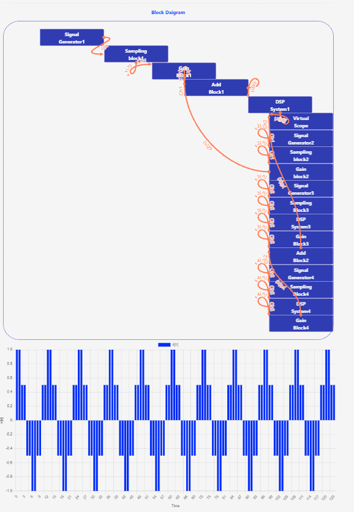
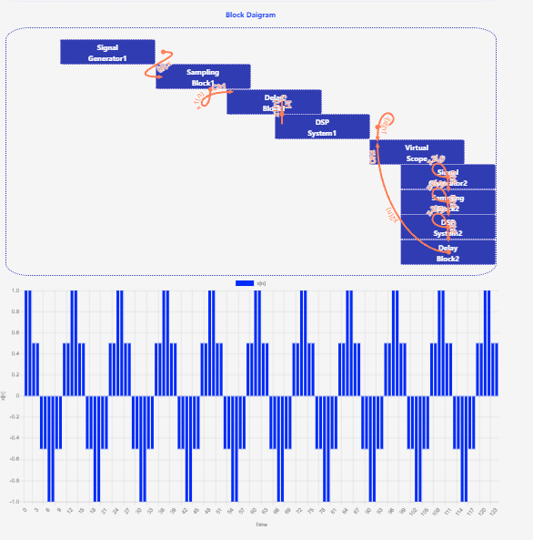

## Procedure

1. Click on the Simulation menu SIMULATOR will open the workspace
                              
2. Read the instruction to understand how the simulation to be executed.

3. Observe the block diagram of Part 1

4. Make connection in the block diagram from procedure tab part1 in fig1
                            
5. Observe two input signal and output signal waveform on graph             
                            
6. Observe the block diagram of Part 2                   
                            
7.                   
                               
8. Make connection in the block diagram from procedure tab part2 in fig1
                              
9. Observe two input signal and output signal waveform on graph                    
                             

                            
